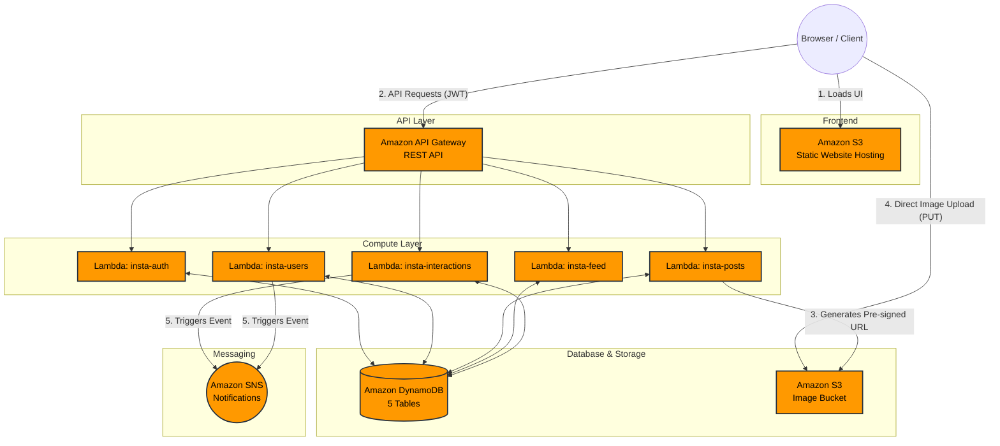

# InstaClone — Instagram-Like Serverless Social Media Application

## Project Overview
InstaClone is a full-stack, serverless social media application inspired by Instagram. Built entirely on AWS, this Capstone project demonstrates a practical implementation of cloud-native architecture, serverless computing, NoSQL database design, secure storage, authentication, and RESTful API development.

## Key Features
* User Authentication: Secure signup and login using JWT authentication.
* User Profiles: Customizable profiles featuring a bio, avatar, and follower/following counts.
* Content Creation: Create posts with image uploads securely handled via S3 pre-signed URLs.
* Personalized Feed: Dynamically generated home feed displaying posts from followed users.
* Social Interactions: Like and unlike posts, and leave comments on posts.
* Follow System: Follow and unfollow other users.
* User Search: Search for users by username or full name.
* Event Notifications: Asynchronous SNS notifications triggered for likes, comments, and follows.

## AWS Services Used
| AWS Service | Purpose |

| Amazon S3 | Hosts the static frontend application and stores user-uploaded images. |
| Amazon API Gateway| Provides a secure REST API routing client requests to Lambda functions. |
| AWS Lambda | Executes serverless Node.js backend logic without provisioning servers. |
| Amazon DynamoDB | Highly scalable NoSQL database storing users, posts, and social graphs. |
| Amazon SNS | Manages publish/subscribe event notifications for social interactions. |
| Amazon CloudWatch | Monitors application health and stores execution logs for Lambda functions. |
| Amazon Route 53 | Manages DNS routing and custom domain configuration (optional). |
| Amazon VPC | Provides an isolated network environment for secure backend execution (optional). |

## Architecture
The application follows a decoupled, event-driven serverless architecture:
1. **Client** requests the frontend application hosted on a public **S3 bucket**.
2. The frontend communicates with the backend via **API Gateway (REST API)**.
3. API Gateway routes requests to specific **Lambda functions** for processing.
4. Lambda functions interact with **DynamoDB** for CRUD operations on application data.
5. For image uploads, Lambda generates a pre-signed URL, allowing the client to upload directly to a secure **S3 bucket**.
6. Social interactions trigger events published to **SNS** for asynchronous notifications.

### Architecture Diagram



## Technology Stack
| Category | Technology |
| :--- | :--- |
| **Frontend** | HTML5, CSS3, Vanilla JavaScript |
| **Compute** | AWS Lambda (Node.js 24.x) |
| **API Layer** | Amazon API Gateway (REST) |
| **Database** | Amazon DynamoDB |
| **Storage** | Amazon S3 |
| **Messaging** | Amazon SNS |

## Project Structure
```text
InstaClone/
├── backend/
│   ├── functions/                   # Lambda function handlers
│   │   ├── auth/                    # Signup & login (insta-auth)
│   │   ├── users/                   # Profiles, follows & search (insta-users)
│   │   ├── posts/                   # Post CRUD & S3 URLs (insta-posts)
│   │   ├── feed/                    # Feed generation (insta-feed)
│   │   └── interactions/            # Likes & comments (insta-interactions)
│   │       ├── index.js
│   │       ├── package.json
│   │       └── utils/               # Shared utils (auth, dynamodb, response)
│   └── schema/
│       └── tables.json              # DynamoDB table definitions
└── frontend/
    ├── index.html                   # Feed (home page)
    ├── login.html                   # Login
    ├── signup.html                  # Sign up
    ├── profile.html                 # User profile
    ├── create.html                  # Create post
    ├── post.html                    # Single post view
    ├── css/
    │   └── style.css                # Global styles
    └── js/
        ├── config.js                # API Gateway URL config
        ├── api.js                   # API client
        ├── auth.js                  # Auth state management
        └── ...                      # Page-specific logic scripts

Backend Architecture :
The backend is composed of five distinct, self-contained AWS Lambda functions. Each function handles a specific microservice domain (Auth, Users, Posts, Feed, Interactions) and includes its own bundled utilities and node_modules dependencies to keep package sizes optimized. API Gateway routes HTTP requests to the appropriate Lambda function, which verifies JWT authorization, performs DynamoDB transactions, and manages S3/SNS integrations.

Frontend :
The frontend is a lightweight Single Page Application (SPA) built with HTML, CSS, and Vanilla JavaScript. It is hosted as a static website on Amazon S3. The application manages state locally, stores JWT tokens securely, and dynamically renders the UI by communicating with API Gateway using the Fetch API.

Database Design :
The application utilizes Amazon DynamoDB with a single-table or optimized multi-table design. Below are the 5 core tables:

Table	Partition Key	Sort Key	GSIs (Global Secondary Indexes)
InstaUsers	userId (S)	—	email-index, username-index
InstaPosts	postId (S)	—	userId-createdAt-index
InstaLikes	postId (S)	userId (S)	—
InstaComments	postId (S)	commentId (S)	—
InstaFollows	followerId (S)	followingId (S)	followingId-followerId-index
API Documentation
The API Gateway exposes a RESTful interface mapped to the Lambda microservices:

Method	Endpoint	Purpose	Lambda Function
POST	/api/auth/signup	Register a new user	insta-auth
POST	/api/auth/login	Authenticate user & issue JWT	insta-auth
GET	/api/users/search	Search users by name/username	insta-users
GET/PUT	/api/users/{id}	Get or update user profile	insta-users
POST/DEL	/api/users/{id}/follow	Follow or unfollow a user	insta-users
GET	/api/users/{id}/followers	List user's followers	insta-users
GET	/api/users/{id}/following	List users the user follows	insta-users
GET	/api/users/{id}/posts	Fetch a user's posts	insta-posts
GET	/api/posts/upload-url	Generate S3 pre-signed upload URL	insta-posts
POST	/api/posts	Create a new post record	insta-posts
GET/DEL	/api/posts/{id}	Retrieve or delete a post	insta-posts
POST/DEL	/api/posts/{id}/like	Like or unlike a post	insta-interactions
GET/POST	/api/posts/{id}/comments	Fetch or add a comment	insta-interactions
DELETE	/api/comments/{id}	Delete a specific comment	insta-interactions
GET	/api/feed	Retrieve personalized user feed	insta-feed

S3 Configuration :
Frontend Hosting Bucket: Configured for static website hosting with a bucket policy allowing public read access (s3:GetObject).
Image Storage Bucket: Secured bucket for user uploads. CORS is explicitly configured to allow PUT and GET methods from the frontend domain to facilitate direct pre-signed URL uploads.

Lambda Deployment
Runtime: Node.js 24.x
Timeout: 30 seconds
Packaging: Each function is zipped individually with its index.js, utils/, and node_modules/.
Environment Variables
Example configuration (Do not commit real secrets to GitHub):
env
JWT_SECRET=your-secret-key-change-this
S3_BUCKET_IMAGES=your-images-bucket-name
S3_REGION=us-east-1
SNS_TOPIC_ARN=arn:aws:sns:us-east-1:ACCOUNT_ID:insta-notifications
DYNAMODB_REGION=us-east-1
API Gateway Configuration
Type: REST API
CORS: Enabled on all resources with an OPTIONS method using Mock integration for preflight requests.
Stage: Deployed to a production stage (e.g., prod).
Authentication & Security
JWT Authentication: The insta-auth Lambda verifies credentials and issues signed JSON Web Tokens (JWT). Subsequent requests to protected routes validate this token.
Direct-to-S3 Uploads: Image uploads bypass the API/Lambda bottlenecks using secure S3 Pre-Signed URLs with strict expiration times.

IAM Permissions :
Lambda execution roles are strictly bound by the principle of least privilege, requiring:
DynamoDB: Read/Write access strictly to Insta* tables.
S3: PutObject and GetObject on the images bucket only.
SNS: Publish permission to the specific insta-notifications topic.
CloudWatch: Standard permissions to create log groups and streams.

SNS Notifications :
An SNS topic (insta-notifications) routes events via email/SMS subscriptions. It is asynchronously invoked by Lambda when:
A user receives a new follower.
A user's post receives a like.
A user's post receives a new comment.

AWS Deployment Guide
DynamoDB: Execute the definitions in backend/schema/tables.json to create the 5 tables with their respective GSIs.
S3: Provision the frontend and image buckets. Apply CORS configuration to the images bucket.
Lambda: Run npm install inside each of the 5 function folders, zip them, upload to AWS Lambda, and configure the environment variables & IAM roles.
API Gateway: Create the REST routes, integrate them with the Lambda functions, enable CORS, and deploy the API.
Frontend: Update frontend/js/config.js with your invoked API Gateway URL, then upload the frontend/ contents to your static S3 bucket.

Testing
 - Open the S3 static website URL in a browser.
 - Sign up for a new account & Login.
 - Create a post by successfully uploading an image to S3.
 - View the personalized home feed.
 - Create a second account, search for the first user, and follow them.
 - Verify the feed accurately populates posts from followed users.
 - Like and comment on a post to trigger SNS notifications.
